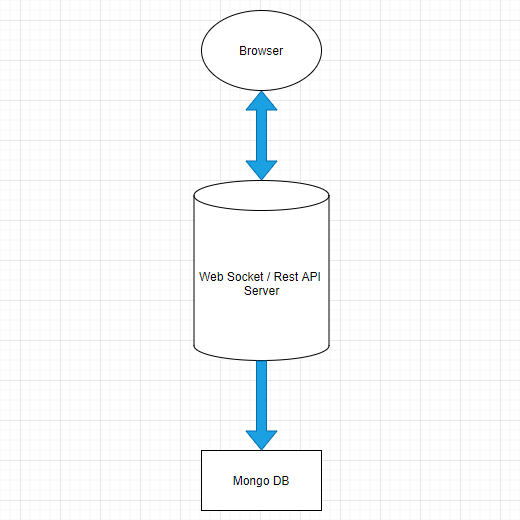

# Blackjack Web App

## Stack

| Tech       | Host    |
| ---------- | ------- |
| React      | Netlify |
| ExpressJS  | DigitalOcean |
| MongoDB    | AWS |

## To-Do

- [x] Landing page
- [x] DB for rooms
- [x] Ability to create games
- [x] Ability to join games
- [x] Add WebSockets
- [ ] Room page
- [ ] Backend card system
- [ ] Dispatch cards to all users (Web Sockets??)
- [ ] Take user input
- [ ] Dealer output
- [ ] Win condition

## Plan

## Possible future implmentations

- Chat function
- Nice card animations
